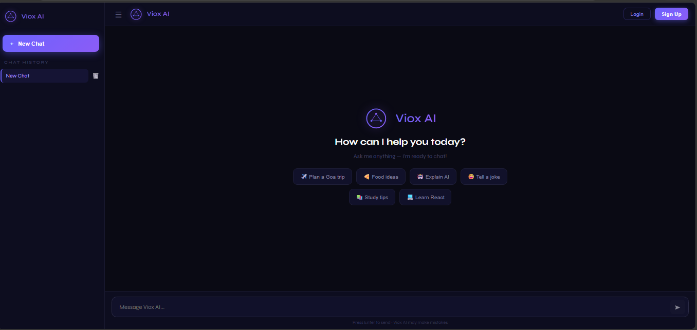

<div align="center">

# 🤖 Viox AI — Chatbot UI

**A modern, responsive AI chatbot interface built with React + Vite**

[](https://react.dev)
[](https://vitejs.dev)
[](https://nodejs.org)
[](LICENSE)

[Live Demo](#) · [Report Bug](../../issues) · [Request Feature](../../issues)

</div>

<br />
## 📸 Preview



---

## 📌 Overview

**Viox AI** is a feature-rich chatbot user interface that provides an intuitive, real-time conversational experience. Built with **React 19** and **Vite**, it uses intelligent keyword-based response matching to answer user queries across domains including travel, food, technology, and casual conversation.

The project is structured to be easily extensible — swap in any AI backend (Gemini, OpenAI, Claude) with minimal changes.

---

## ✨ Features

- 🧠 **Intelligent Keyword Matching** — Contextual responses across multiple domains
- ✈️ **Travel Planning** — Destination advice, budgets, and itinerary tips
- 🍕 **Food & Recipe Ideas** — Meal suggestions and cooking recommendations
- 💻 **Tech Explanations** — AI, machine learning, and software concepts made simple
- ⚡ **Real-Time Chat** — Instant message processing with smooth animations
- 📱 **Fully Responsive** — Seamless experience on desktop, tablet, and mobile
- ⌨️ **Keyboard Support** — Send messages with the `Enter` key
- 🎨 **Polished UI** — Distinct message bubbles with fade-in transitions
- 🔌 **Extensible Architecture** — Easily plug in any LLM API for dynamic responses

---

## 🛠️ Tech Stack

| Category           | Technology                  |
| ------------------ | --------------------------- |
| Frontend Framework | React 19.2.4                |
| Build Tool         | Vite 8.0.1                  |
| Styling            | CSS3 with Responsive Design |
| Linting            | ESLint with React Rules     |
| Package Manager    | npm                         |

---

## 📁 Project Structure

```
chatbotui/
├── src/
│   ├── components/
│   │   ├── ChatContainer.jsx      # Core chat logic & message state
│   │   ├── MessageBubble.jsx      # Individual message rendering
│   │   ├── InputBox.jsx           # Input field & send handler
│   │   └── Logo.jsx               # App branding component
│   ├── App.jsx                    # Root component
│   ├── App.css                    # Component-level styles
│   ├── main.jsx                   # Application entry point
│   ├── index.css                  # Global styles
│   └── assets/                    # Static assets
├── public/                        # Public static files
├── index.html                     # HTML shell
├── package.json                   # Dependencies & scripts
├── vite.config.js                 # Vite configuration
├── eslint.config.js               # ESLint rules
└── README.md
```

---

## 🚀 Getting Started

### Prerequisites

- [Node.js](https://nodejs.org/) `v18.0` or higher
- `npm` or `yarn`

### Installation

```bash
# 1. Clone the repository
git clone https://github.com/your-username/chatbotui.git
cd chatbotui

# 2. Install dependencies
npm install

# 3. Start the development server
npm run dev
```

Open [http://localhost:5173](http://localhost:5173) in your browser.

---

## 📦 Scripts

| Command           | Description                                  |
| ----------------- | -------------------------------------------- |
| `npm run dev`     | Start dev server with hot module replacement |
| `npm run build`   | Create optimized production build            |
| `npm run preview` | Preview production build locally             |
| `npm run lint`    | Run ESLint checks                            |

---

## 💡 How It Works

User input is processed through a keyword-matching pipeline inside `ChatContainer.jsx`:

1. **Normalize** — Input converted to lowercase for consistent matching
2. **Match** — Keywords compared against predefined topic patterns
3. **Respond** — Contextually relevant reply is generated and rendered

**Sample keyword mappings:**

| Keywords                         | Response Domain                     |
| -------------------------------- | ----------------------------------- |
| `trip`, `travel`, `vacation`     | ✈️ Travel advice & destination tips |
| `food`, `eat`, `recipe`          | 🍕 Meal ideas & cooking help        |
| `ai`, `machine learning`, `tech` | 💻 Technology explainers            |
| `hi`, `hello`, `hey`             | 💬 Greeting & casual conversation   |
| `study`, `learn`, `homework`     | 📚 Study tips & learning resources  |

---

## 🔧 Environment Variables

No API keys are required to run this project. The app uses a fully built-in keyword-based response engine — no external services or accounts needed.

If you later want to connect an LLM API, simply add a `.env.local` file and update `getBotReply()` in `ChatContainer.jsx`.

---

## 🎨 Customization

**Rename the bot:**
Update all `"Viox AI"` references in `src/components/ChatContainer.jsx`.

**Change the look:**
Edit `src/App.css` and `src/index.css` for colors, fonts, and layout.

**Add new response topics:**
Extend the `getBotReply()` function in `ChatContainer.jsx` with new keyword-response pairs.

---

## 🔮 Roadmap

- [ ] LLM API integration (Gemini / OpenAI / Claude)
- [ ] Dark / Light theme toggle
- [ ] Typing indicators & read receipts
- [ ] Chat history persistence with localStorage / database
- [ ] User authentication & session management
- [ ] Multi-language support
- [ ] Emoji reactions
- [ ] Voice message input
- [ ] Image sharing in chat

---

## 🐛 Troubleshooting

**Port already in use?**

```bash
npm run dev -- --port 3000
```

**Build failing?**

```bash
rm -rf node_modules package-lock.json
npm install && npm run build
```

**Linting errors?**

```bash
npm run lint
```

---

## 🤝 Contributing

Contributions are welcome and appreciated!

```bash
# 1. Fork the repository
# 2. Create your feature branch
git checkout -b feature/your-feature-name

# 3. Commit your changes
git commit -m "feat: add your feature description"

# 4. Push to your branch
git push origin feature/your-feature-name

# 5. Open a Pull Request
```

Please follow [Conventional Commits](https://www.conventionalcommits.org/) for commit messages.

---

👤 Author
Srujan Parikh

GitHub: https://github.com/ParikhSrujan
</br>
LinkedIn: https://www.linkedin.com/in/srujan-parikh-9a39222b1
</br>
Demo : sruutaskmanager.netlify.app

## 📄 License

This project is licensed under the **MIT License** — see the [LICENSE](LICENSE) file for details.

---

<div align="center">

Built with ❤️ using **React** and **Vite**

⭐ Star this repo if you found it helpful!

</div>
